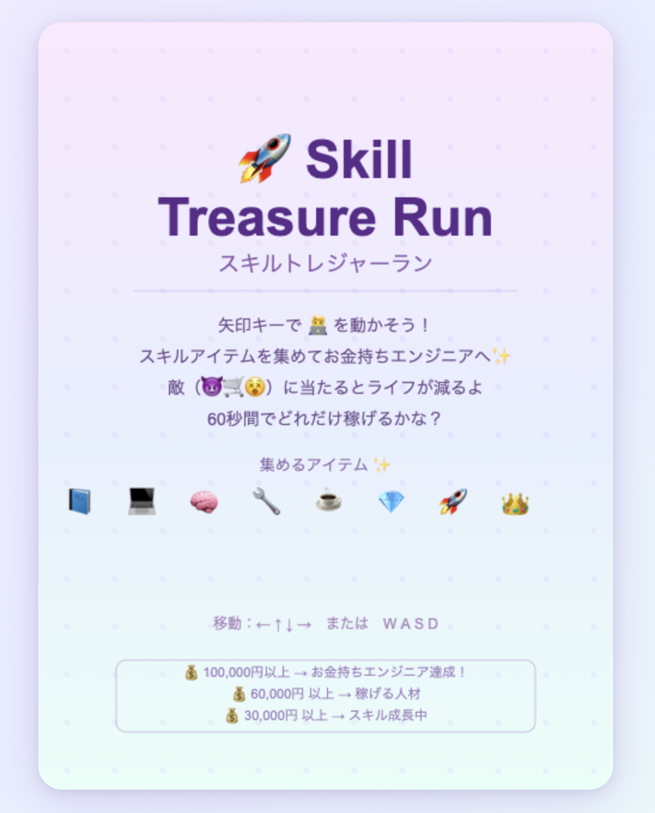

# 🚀 Skill Treasure Run（スキルトレジャーラン）

> スキルという宝物を集めて、お金持ちエンジニアを目指す 60 秒ゲーム

---

## ゲーム概要

矢印キーで 🧑‍💻 を操作し、画面に散らばるスキルアイテムを集めながら、敵を避けて 60 秒間でどれだけ稼げるかを競うブラウザゲームです。

アイテムを取るごとにスコアと所持金が増え、集めたスキル数に応じてレベルが上がります。
ゲーム終了時の所持金でランクが決まります。

---

## 作成目的

| 目的 | 内容 |
|------|------|
| JavaScript 練習 | Canvas API・ゲームループ・当たり判定などを実装で学ぶ |
| GitHub 練習 | git init / add / commit / push の一連の流れを習得する |
| AI 活用練習 | Claude を使った開発管理・設計ドキュメント作成を練習する |
| 設計者スキルへの足掛かり | ゲーム設計 → ドキュメント化を通じて設計思考を養う |

---

## 使用技術

- HTML5 / CSS3
- JavaScript（Vanilla JS・フレームワーク不使用）
- Canvas API（2D 描画）

---

## 遊び方

| 操作 | キー |
|------|------|
| 移動 | 矢印キー（← ↑ ↓ →）または W A S D |
| ゲーム開始 | スペースキー |
| リスタート | R キー（ゲームオーバー後） |
| タイトルへ戻る | スペースキー（ゲームオーバー後） |

---

## 主な機能

- **60 秒タイムアタック** — 残り時間に応じてアイテムの出現ペースが加速
- **アイテム収集** — 通常（85%）とレア（15%）の 2 種類
- **敵キャラ 3 種** — 時間経過で段階的に増加するため、後半は難易度が上がる
- **レベルシステム** — 取得アイテム数に応じて肩書きが変わる（全 5 段階）
- **ランクシステム** — ゲーム終了時の所持金でランク判定（全 5 段階）
- **エフェクト** — アイテム取得時のパーティクル・ダメージ時の画面揺れ
- **無敵時間** — 被弾後 2 秒間の無敵でゲームバランスを調整

---

## 画面イメージ

---

## 今後追加したい機能

- [ ] スマートフォン対応（タッチ操作）
- [ ] ハイスコア保存（localStorage）
- [ ] BGM・効果音
- [ ] GitHub Pages での公開
- [ ] 難易度選択（かんたん / ふつう / むずかしい）

---

## 学習ポイント

### JavaScript
- `requestAnimationFrame` によるゲームループの仕組み
- Canvas API での図形・絵文字の描画
- 円と円の当たり判定（距離計算）
- `filter` で配列の要素を管理（アイテム・敵・パーティクル）

### Git / GitHub
- `git init` → `git add` → `git commit` → `git push` の基本フロー
- SSH キー設定（個人 GitHub アカウントの分離）
- README.md と設計ドキュメントの整備

### 設計
- 状態管理（TITLE / PLAYING / GAMEOVER）の考え方
- データをテーブル（配列）で定義して拡張しやすくする設計
- HUD・フィールド・エフェクトを関数で分割する構造化
